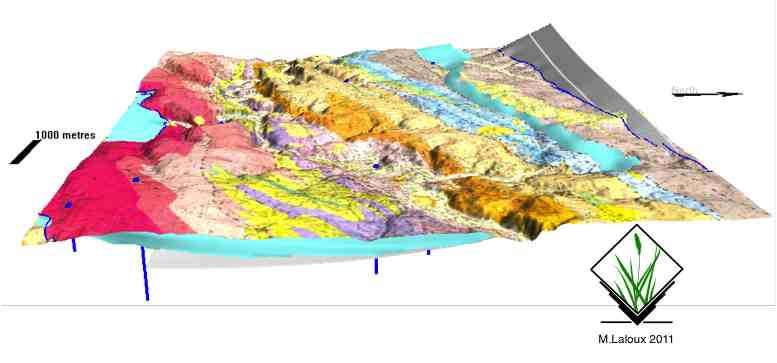
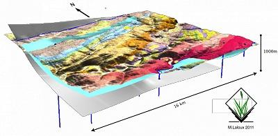
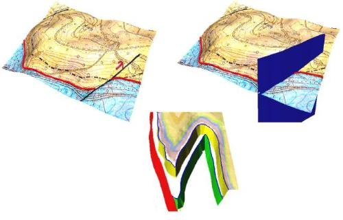
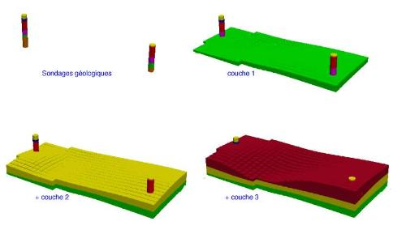
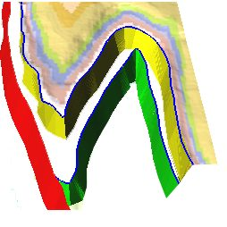
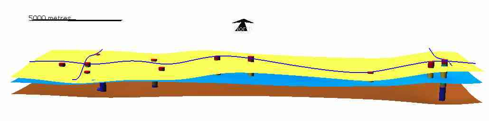
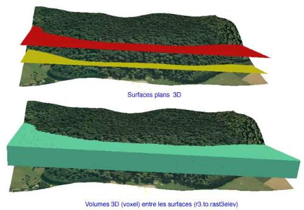
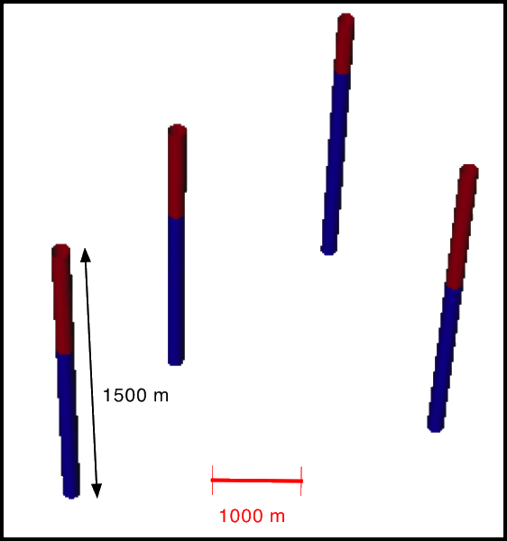

Mémo de quelques unes de mes réalisations en Géologie 3D avec GRASS GIS et/ou Python
=============================

  Une petite illustration de ce qu'il est possible de faire en 3D avec GRASS GIS afin de sérier les questions (comme je suis géologue et que la 3D est omniprésente, ce seront des exemples géologiques), publiés dans:
 
  - [Grass Gis et Paraview: la modélisation géologique 3D pour les démunis, ou les enthousiastes...](https://portailsig.org/content/grass-gis-et-paraview-la-modelisation-geologique-3d-pour-les-demunis-ou-les-enthousiastes.html)  
  - [El modelado geólogico para un geológo sin recursos o entusiasta: GRASS GIS (y Paraview) ](http://geotux.tuxfamily.org/index.php/es/component/k2/item/322-el-modelado-geologico-para-un-geologo-sin-recursos-o-entusiasta-grass-gis-y-paraview)
  - [GRASS et la 3D: illustration de ce qu'il est possible de faire ](http://www.forumsig.org/showthread.php/34498-GRASS-et-la-3D-illustration-de-ce-qu-il-est-possible-de-faire)
  - [vagabondages géologiques (3D) avec GRASS GIS](http://osgeo-org.1560.x6.nabble.com/vagabondages-geologiques-3D-avec-GRASS-GIS-td4981860.html)
  - [Is there are QGIS plugin to allow the 3d visualisation of geological borehole data similar to the functionality of Target for ArcGIS?](http://gis.stackexchange.com/questions/41701/is-there-are-qgis-plugin-to-allow-the-3d-visualisation-of-geological-borehole-da)
  - [3D geological volume modeling (raster 3D): is it really possible ? ](http://osgeo-org.1560.x6.nabble.com/3D-geological-volume-modeling-raster-3D-is-it-really-possible-td4980148.html)
  
###  Faille du Midi:

 
    
 
 
 

### Est de la Belgique

 
 
 

drapage et vecteurs 3D (failles et limites de couches géologiques)

    

  

[Grass Gis et Paraview: la modélisation géologique 3D pour les démunis, ou les enthousiastes...](http://portailsig.org/content/grass-gis-et-paraview-la-modelisation-geologique-3d-pour-les-demunis-ou-les-enthousiastes)

